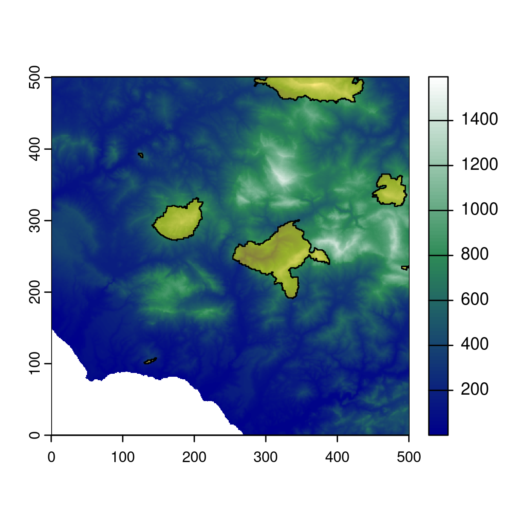
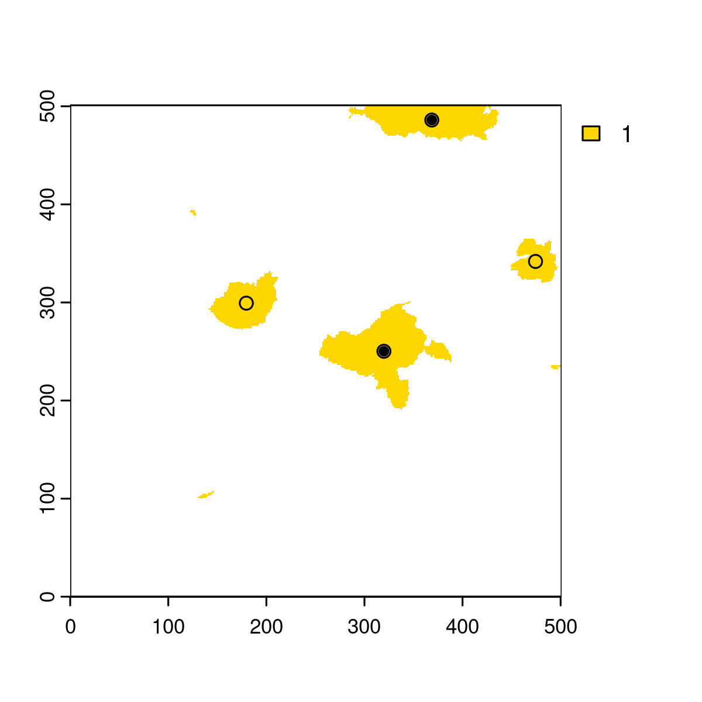
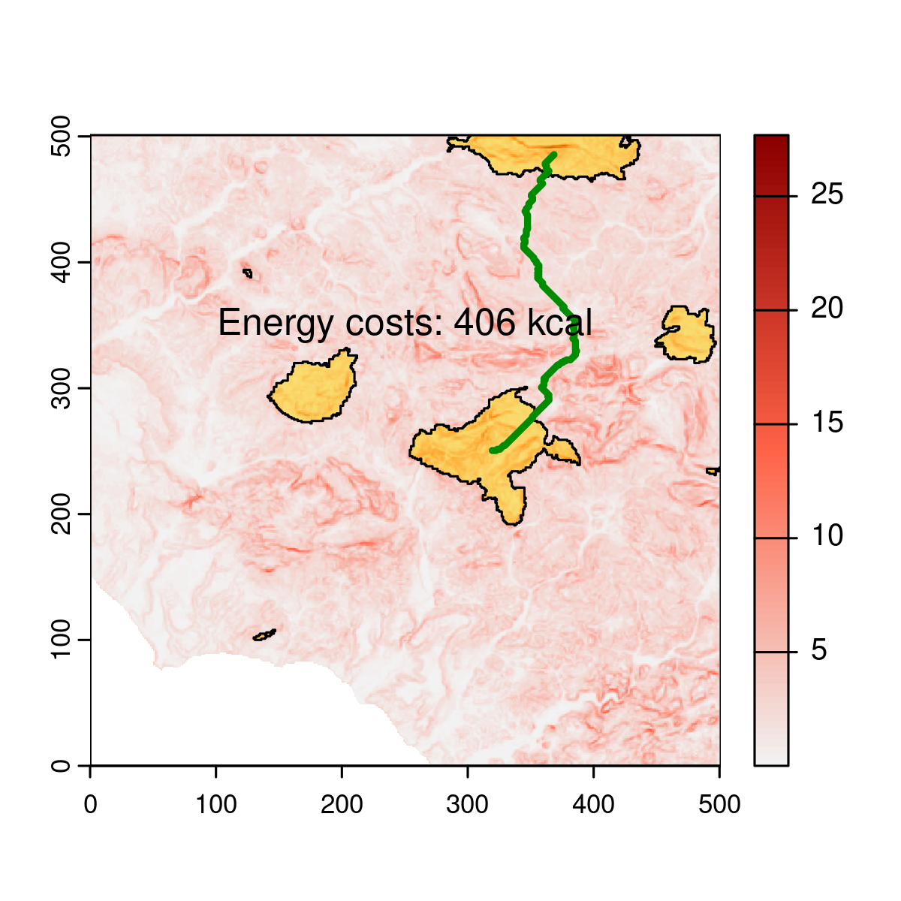
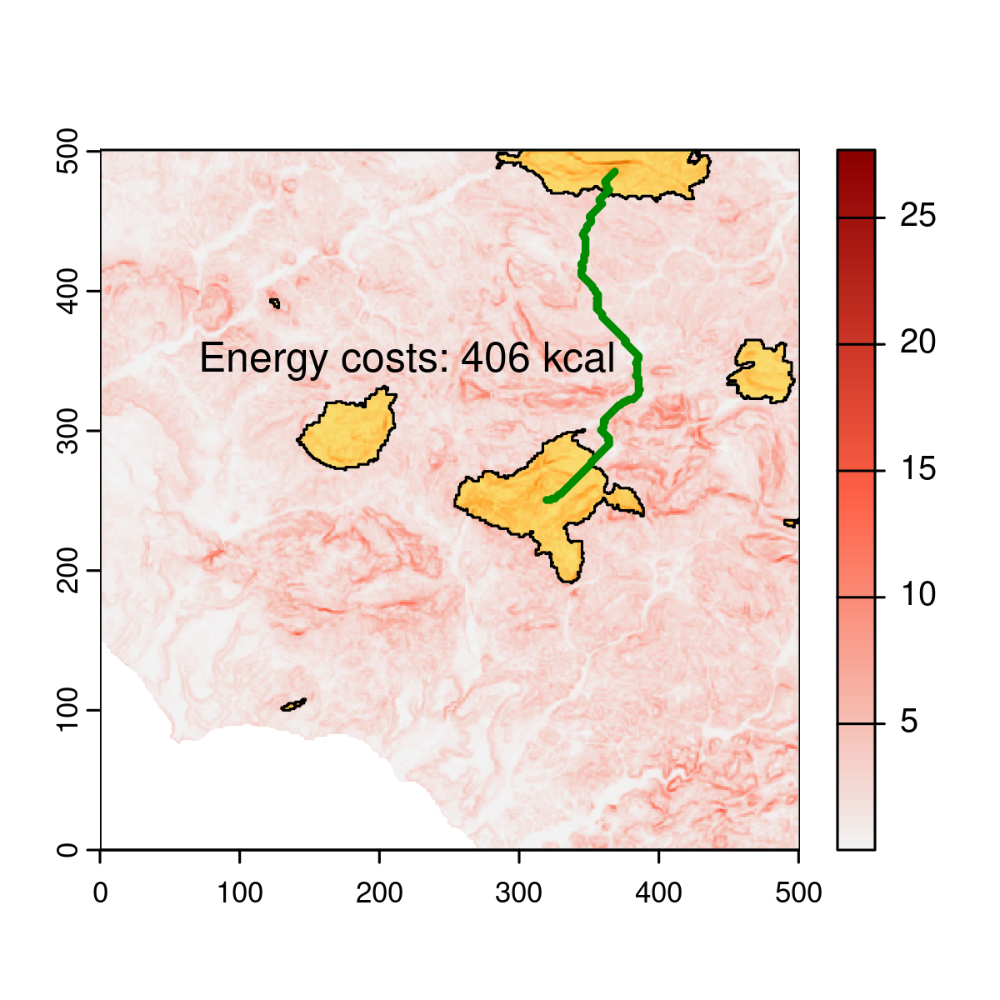

Emilio Berti

[](https://doi.org/10.5281/zenodo.10890031)

# Development and dependecies

The R package *parthian* is developed and maintained by Emilio Berti
(<emilio.berti@idiv.de>). There are several dependencies for *parthian*:

- Rcpp
- igraph
- terra
- enerscape

They are all stable packages with long history, except for *enerscape*,
which I developed in 2021 and maintain since then:
<https://cran.r-project.org/package=enerscape> and
<https://doi.org/10.1111/2041-210X.13734>.

``` r
library(terra)
#> terra 1.7.71
library(enerscape)
library(igraph)
#> 
#> Attaching package: 'igraph'
#> The following object is masked from 'package:enerscape':
#> 
#>     distances
#> The following objects are masked from 'package:terra':
#> 
#>     blocks, compare, union
#> The following objects are masked from 'package:stats':
#> 
#>     decompose, spectrum
#> The following object is masked from 'package:base':
#> 
#>     union
library(parthian)
```

# Workflow

## Introduction

The scope of *parthian* is to quantify the importance of areas in the
landscape based on energy cost of movement for animals. This is achieved
by building a weighted graph between adjacent cells using as weights the
cost of transport
()
between them. This weighted graph is used to obtain least-cost paths and
to rank areas based on their importance in promoting movement across
such paths.

There are two datasets in *parthian*:

- dem: a digital elevation model for an area in Sicily, Italy.
- pa: the protected areas in the same region.

These are matrices, as it is easier to store them in an R package. The
first thing is to transform them into raster.

``` r
data(dem)
dem <- rast(
  dem,
  crs = "+proj=utm +zone=32 +datum=WGS84 +units=m +no_defs"
)
data(pa)
pa <- rast(
  pa,
  crs = "+proj=utm +zone=32 +datum=WGS84 +units=m +no_defs"
)
plot(dem, col = colorRampPalette(c("darkblue", "seagreen", "white"))(100))
plot(pa, add = TRUE, col = adjustcolor("gold", alpha.f = .5), legend = FALSE)
lines(as.polygons(pa))
```



The resolution and extent of the layers are wrong (I need to fix this in
the package data), but it does not matter too much for the examples.

## Energy landscape

The next step is to calcualte the energy landscape for the animal. Here,
I am assuming an animal of 10 kg.

``` r
en <- enerscape(dem, 10, "kcal")
#> DEM is assumed to have planar CRS in meters.
plot(en, col = colorRampPalette(c("grey95", "tomato", "darkred"))(100))
plot(pa, add = TRUE, col = adjustcolor("gold", alpha.f = .5), legend = FALSE)
lines(as.polygons(pa))
```


## Weighted graph

The main task of *parthian* is to create a graph where vertices (*V*)
are the cells of the energy landscapes and weighted edges (*E*)

if two cells are adjacent, and

if they are not.

``` r
g <- cost_graph(en)
```

Generally, there are as many vertices as number of cells

``` r
length(V(g)) == ncell(en)
#> [1] TRUE
```

but the number of edges may be lower than
, as some paths may
be blocked, in this example by the sea.

``` r
length(E(g)) == ncell(en) * 8
#> [1] FALSE
```

## Least cost paths

Least-cost paths can be obtained using the weighted graph created by
`cost_graph()` and the *igraph* `shortest_paths()` function. First,
let’s get the centroids of the protected area, after exlcuding very
small areas
():

``` r
pas <- disagg(as.polygons(pa))
pas <- pas[expanse(pas, "m") > 100, ]
centrs <- centroids(pas)
plot(pa, col = "gold")
points(centrs, cex = 1, pch = 21)
points(centrs[c(1, 4), ], cex = 1, pch = 20)
```


Let’s calcualte the least-cost path between the two areas highlighted by
the solid circle. Because there is a one-to-one correspondence between
cell and vertex ID, this can be achieved by:

``` r
xy <- extract(en, centrs[c(1, 4), ], cells = TRUE)
lcp <- shortest_paths(g, xy$cell[1], xy$cell[2])
path <- lcp$vpath[[1]]
path <- xyFromCell(en, as.numeric(path))
path <- vect(path, crs = crs(dem))
total_costs <- sum(extract(en, path)[["EnergyScape"]])
```

``` r
plot(en, col = colorRampPalette(c("grey95", "tomato", "darkred"))(100))
plot(pa, add = TRUE, col = adjustcolor("gold", alpha.f = .5), legend = FALSE)
lines(as.polygons(pa))
lines(as.lines(path), lw = 3, col = "green4")
text(220, 350, paste("Energy costs:", round(total_costs), "kcal"))
```



The function `parthian_path()` wraps the above code and can be called
from *parthian*.

``` r
lcp <- parthian_path(g, en, centrs[1], centrs[4])
lcp
#> $lcp
#>  class       : SpatVector 
#>  geometry    : lines 
#>  dimensions  : 1, 0  (geometries, attributes)
#>  extent      : 319.5, 386.5, 250.5, 485.5  (xmin, xmax, ymin, ymax)
#>  coord. ref. : +proj=utm +zone=32 +datum=WGS84 +units=m +no_defs 
#> 
#> $costs
#> [1] 406.3804
```

`parthian_path()` returns the least-cost path as a SpatVector and its
total travel costs, which are the same as before.

``` r
plot(en, col = colorRampPalette(c("grey95", "tomato", "darkred"))(100))
plot(pa, add = TRUE, col = adjustcolor("gold", alpha.f = .5), legend = FALSE)
lines(as.polygons(pa))
lines(lcp$lcp, lw = 3, col = "green4")
text(220, 350, paste("Energy costs:", round(lcp$costs), "kcal"))
```



Instead of calculating least-cost paths manually, *parthian* uses the
function `parthian_paths()` to obtain them iteratively between all
cells.

``` r
message("to do")
#> to do
```
