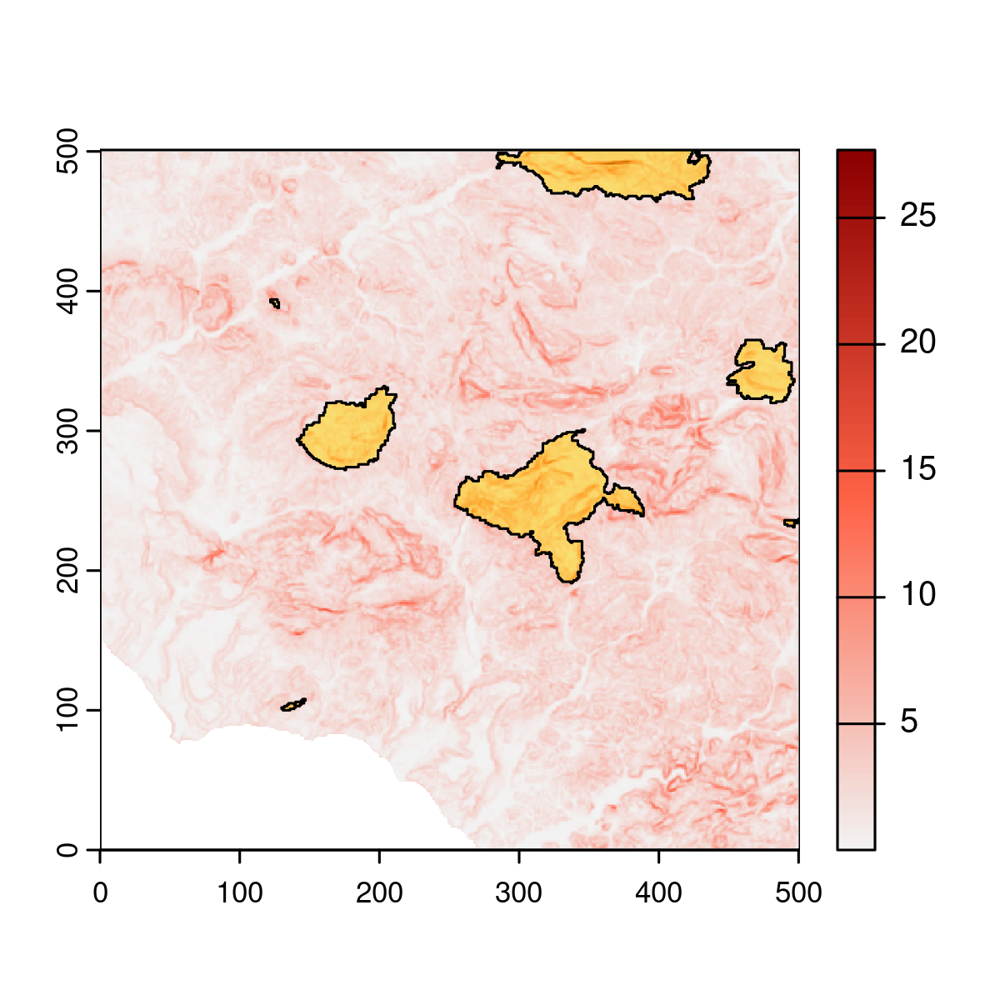

Emilio Berti

[](https://doi.org/10.5281/zenodo.10890031)

# General information

The R package *parthian* is developed and maintained by Emilio Berti
(<emilio.berti@idiv.de>). The scope of *parthian* is to quantify the
importance of areas in the landscape based on energy cost of movement
for animals. There are several dependencies for *parthian*:

- Rcpp
- igraph
- terra
- enerscape

They are all stable packages with long history, except for *enerscape*,
which I developed in 2022 and maintain since then:
<https://cran.r-project.org/package=enerscape> and
<https://doi.org/10.1111/2041-210X.13734>.

``` r
library(terra)
#> terra 1.7.71
library(enerscape)
library(igraph)
#> 
#> Attaching package: 'igraph'
#> The following object is masked from 'package:enerscape':
#> 
#>     distances
#> The following objects are masked from 'package:terra':
#> 
#>     blocks, compare, union
#> The following objects are masked from 'package:stats':
#> 
#>     decompose, spectrum
#> The following object is masked from 'package:base':
#> 
#>     union
library(parthian)
```

# Introduction

There are two datasets in *parthian*:

- dem: a digital elevation model for an area in Sicily, Italy.
- pa: the protected areas in the same region.

These are matrices, as it is easier to store them in an R package. The
first thing is to transform them into raster.

``` r
data(dem)
dem <- rast(
  dem,
  crs = "+proj=utm +zone=32 +datum=WGS84 +units=m +no_defs"
)
data(pa)
pa <- rast(
  pa,
  crs = "+proj=utm +zone=32 +datum=WGS84 +units=m +no_defs"
)
plot(dem, col = colorRampPalette(c("darkblue", "seagreen", "white"))(100))
plot(pa, add = TRUE, col = adjustcolor("gold", alpha.f = .5), legend = FALSE)
lines(as.polygons(pa))
```


The resolution and extent of the layers are wrong (I need to fix this in
the package data), but it does not matter too much for the examples.

The next step is to calcualte the energy landscape for the animal. Here,
I am assuming an animal of 10 kg.

``` r
en <- enerscape(dem, 10, "kcal")
#> DEM is assumed to have planar CRS in meters.
plot(en, col = colorRampPalette(c("grey95", "tomato", "darkred"))(100))
plot(pa, add = TRUE, col = adjustcolor("gold", alpha.f = .5), legend = FALSE)
lines(as.polygons(pa))
```



The main task of *parthian* is to create a graph where vertices (*V*)
are the cells of the energy landscapes and weighted edges (*E*)
$E_{ij} = E_{COT}$ if two cells are adjacent, and $E_{ij} = 0$ if they
are not.

``` r
g <- cost_graph(en)
```

Generally, there are as many vertices as number of cells

``` r
length(V(g)) == ncell(en)
#> [1] TRUE
```

but the number of edges may be lower than $8V$, as some paths may be
blocked, in this example by the sea.

``` r
length(E(g)) == ncell(en) * 8
#> [1] FALSE
```

# Least cost paths

Least-cost paths can be obtained using the weighted graph created by
`cost_graph()` and the *igraph* `shortest_paths()` function. First,
let’s get the centroids of the protected area, after exlcuding very
small areas ($\leq 100 m^2$):

``` r
pas <- disagg(as.polygons(pa))
pas <- pas[expanse(pas, "m") > 100, ]
centrs <- centroids(pas)
plot(pa, col = "gold")
points(centrs, cex = 1, pch = 21)
points(centrs[c(1, 4), ], cex = 1, pch = 20)
```


Let’s calcualte the least-cost path between the two areas highlighted by
the solid circle. Because there is a one-to-one correspondence between
cell and vertex ID, this can be achieved by:

``` r
xy <- extract(en, centrs[c(1, 4), ], cells = TRUE)
lcp <- shortest_paths(g, xy$cell[1], xy$cell[2])
path <- lcp$vpath[[1]]
path <- xyFromCell(en, as.numeric(path))
path <- vect(path, crs = crs(dem))
total_costs <- sum(extract(en, path)[["EnergyScape"]])
```

``` r
plot(en, col = colorRampPalette(c("grey95", "tomato", "darkred"))(100))
plot(pa, add = TRUE, col = adjustcolor("gold", alpha.f = .5), legend = FALSE)
lines(as.polygons(pa))
lines(as.lines(path), lw = 3, col = "green4")
text(220, 350, paste("Energy costs:", round(total_costs), "kcal"))
```


